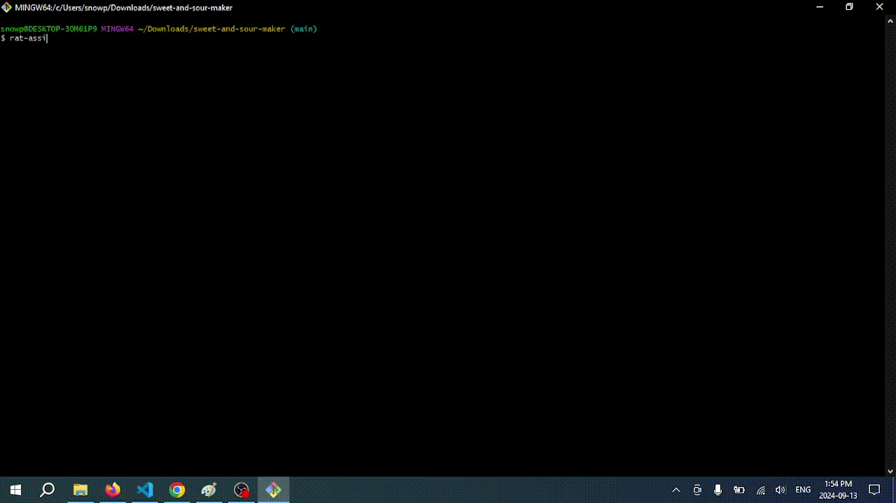

# Rat helper

This is a litle command line buddy who'll help you figure out how to improve your code, a rat.
You give it the file(s) you're working on and a question on how to improve it and it'll tell you what it thinks.

rat-assistant <command> [...flags]

### Installation

You can use npm/pnpm or bun to install this.

## NPM

Install: npm i rat-assistant
This will install it

You can make it accessibile globally with:
npm run setup-npm
which would let you access it anywhere
and then
npm run destroy-npm
to get rid of it globally

## Bun

Install: bun add rat-assistant
You can make it accessible globally with:
bun run setup
or install it bun install -g rat-assistant

### Arguments

Positionals:
files path to file that it will parse [string]

Options:
-k, --api-key the apikey of the api endpoint your using
[string] [required] [default: "-----"]

-e, --end-point api end point of the llm
[string] [default: "https://api.groq.com/openai/v1"]

-m, --model language model to use [string] [default: "llama3-8b-8192"]

-r, --rubber-ratty What you want the ducky to explain [string] [required]

-o, --output file to output to [string]

-a, --append whether it destructively writes to file or appends ot
[boolean] [default: "false"]

-t, --token-usage provides token usage information at the end of output

-v, --version version showing [boolean]

-h, --help shows the commands [boolean]
